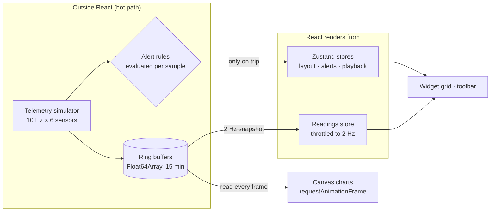

# GridPulse

**Real-time industrial telemetry dashboard — built to answer one question: how do you stream 10 Hz sensor data into a React UI without drowning in re-renders?**

🔗 **Live demo:** _add your Vercel URL here_

   

GridPulse simulates the monitoring console for a combined-cycle power unit: six sensors emitting at 10 Hz, live trend charts, gauges, configurable alert thresholds, a replay scrubber for incident review, and a natural-language query bar over the data. The domain comes from my day job building industrial visualization platforms (Angular) — this project rebuilds the hardest part of that problem in React, deliberately.

## The core engineering problem

A naive implementation puts samples in React state:

```
sample arrives → setState → reconcile → re-render chart → 10 Hz × 6 sensors × N widgets
```

That melts. GridPulse's architecture keeps high-frequency data **outside React entirely**:



Three rules fall out of this:

1. **Ring buffers own the samples.** Each sensor writes into a fixed-capacity `Float64Array` circular buffer (`src/data/ringBuffer.ts`) — no GC churn, O(1) writes, windowed reads for any time range.
2. **Canvas charts bypass React.** `TelemetryChart` mounts a `<canvas>` once, then a `requestAnimationFrame` loop reads the buffer directly each frame (`src/components/TelemetryChart.tsx`). The chart scrolls at 60 fps while React's commit count for the component stays at ~1.
3. **React state is low-frequency by construction.** Numeric readouts update from a 2 Hz throttled snapshot; alert events enter the store only when a rule actually trips. Nothing in Zustand updates at sample rate.

## Features

- **Widget canvas** — trend charts, gauges, readouts, and an alert feed; drag headers to reorder (hand-rolled drag logic, no grid library), resize S/M/L, swap sensors per widget
- **Alert engine** — arm `>` / `<` thresholds per sensor; rules are evaluated on every sample in the data layer, with a cooldown so a sustained excursion doesn't spam events
- **Replay scrubber** — scrub back through 15 minutes of buffered history; clicking an alert jumps the whole dashboard to that moment ("what did every sensor look like when vibration spiked?")
- **Ask GridPulse** — natural-language queries (`"peak vibration last 10 min"`, `"average power output"`). A local parser converts text → structured `DataQuery` → buffer execution. The parser is a documented LLM seam: swap `parseQuery` for a model call returning the same JSON schema and nothing downstream changes (`src/ai/queryEngine.ts`)
- **Fault injection** — the simulator randomly spawns drifting anomalies so the alert pipeline has something real to catch

## Angular vs React: notes from rebuilding a familiar problem

I build this category of UI professionally in Angular. Rebuilding it in React surfaced real contrasts:

| Concern | Angular (my day job) | React (this project) |
|---|---|---|
| Streaming data | RxJS observables end-to-end; `async` pipe + OnPush | Push streams out of the view layer entirely; rAF + refs |
| Escaping change detection | `runOutsideAngular` | Canvas + refs — the framework never sees the hot path |
| Derived state | RxJS operators (`scan`, `withLatestFrom`) | Selectors on Zustand; throttling done at the bridge |
| Component memoization | OnPush + immutable inputs | `memo` + stable keys so reorders don't remount charts |

The punchline: the winning architecture is framework-agnostic — get high-frequency data out of the framework's reactivity system, in both frameworks. The difference is where each framework makes that easy.

## Run it

```bash
npm install
npm run dev      # http://localhost:5173
npm run build    # type-check + production bundle
```

No backend, no API keys — the simulator is in-browser, behind a `TelemetrySource` interface (`src/simulator/engine.ts`) designed so a real WebSocket feed is a drop-in replacement.

## Stack

React 19 · TypeScript (strict) · Zustand 5 · Vite · hand-rolled Canvas charts · zero runtime chart/grid dependencies

---

Built by [Shrinika Telu](https://shrinikatelu.github.io/) — [LinkedIn](https://www.linkedin.com/in/shrinikatelu/)
